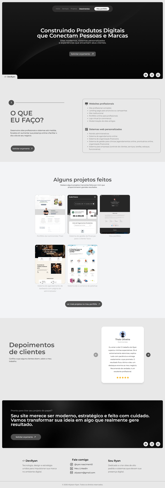

# Site de Apresentação de Serviços — Captação de Clientes

Este projeto é um **site institucional de apresentação de serviços**, desenvolvido para **uso próprio na captação de clientes**.  
Ele é utilizado como material de apoio em abordagens diretas (Instagram, WhatsApp e LinkedIn), com o objetivo de explicar de forma clara **quem sou, o que faço e como posso ajudar profissionais e escritórios**.

Diferente de um portfólio tradicional, este site foi pensado para **conversão e clareza**, não apenas para exibição técnica.

---

## 🎯 Objetivo do Projeto

- Apresentar meus serviços de desenvolvimento web de forma simples e profissional
- Ajudar potenciais clientes a entender rapidamente:
  - qual problema eu resolvo
  - como meu serviço melhora o dia a dia deles
  - se faz sentido entrar em contato
- Servir como **ferramenta direta de captação de clientes**

---

## 🧩 Contexto de Uso

Este site é enviado diretamente para potenciais clientes após um primeiro contato, funcionando como:

- cartão institucional digital
- material de validação de credibilidade
- ponto central de explicação dos serviços oferecidos

Ele **não substitui** um portfólio completo, mas complementa a abordagem comercial.

---

## 🛠️ Tecnologias Utilizadas

O projeto foi desenvolvido com uma stack moderna e enxuta, focada em performance, organização e facilidade de manutenção:

- **React 19**
- **Vite**
- **React Router DOM**
- **React Scroll**
- **Tailwind CSS**
- **Clean Code**

---

## 📦 Scripts Disponíveis

```bash
# Inicia o projeto em ambiente de desenvolvimento
npm run dev

# Gera a build de produção
npm run build

# Visualiza a build localmente
npm run preview
```

# Screenshot

Aqui temos a captura de tela do projeto:

